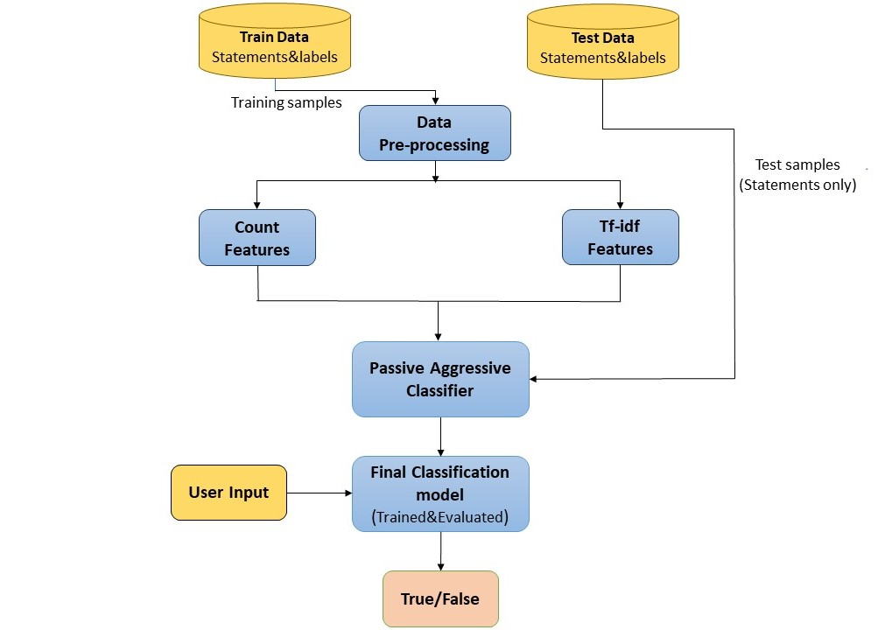

# TruthLens: Advanced Fake News Detection 🔍



## Table of Contents
- [Introduction](#introduction)
- [Tech Stack](#tech-stack)
- [Key Features](#key-features)
- [Project Architecture](#project-architecture)
- [The Model](#the-model)
- [Prerequisites](#prerequisites)
- [Installation & Setup](#installation--setup)
- [Author](#author)

## Introduction
**TruthLens** is an advanced, machine-learning-powered Fake News Detection application developed to combat the spread of misinformation in the digital age. By utilizing state-of-the-art Natural Language Processing (NLP) techniques, TruthLens analyzes both manual text input and live web articles to predict whether the content is reliable or potentially deceptive.

This project goes beyond simple classification by providing an immersive, fully animated Dark Mode UI with Glassmorphism aesthetics, offering users a beautiful and intuitive experience.

## Tech Stack

| Category | Technologies |
|---|---|
| **Machine Learning** | `scikit-learn`, `pandas`, `numpy`, `nltk` |
| **Web Scraping** | `beautifulsoup4`, `requests` |
| **Backend Framework** | `Flask` |
| **Frontend** | Vanilla JS, HTML5, TailwindCSS |

## Key Features
- **🌐 Live URL Web Scraping**: Instantly extract and analyze text from any live news article URL using `BeautifulSoup`.
- **🧠 Explainable AI (XAI)**: TruthLens doesn't just give a result; it highlights the top contributing words that led the AI to its conclusion, offering transparency.
- **💾 Local History Panel**: Automatically saves your most recent analysis queries in your browser using `localStorage`, allowing you to revisit past checks.
- **🐦 Social Media Integration**: A dedicated "Share Result" button lets users quickly tweet their findings on X (formerly Twitter).
- **✨ Premium Animated UI**: A beautifully crafted frontend built with TailwindCSS, featuring animated starry backgrounds, sleek glassmorphism panels, and interactive tabbed inputs.

## Project Architecture
The application runs on a Python Flask backend serving a highly optimized HTML/CSS/JS frontend.
- **Backend (`app.py`)**: Handles the routing, web scraping, and NLP inference via Scikit-Learn.
- **Frontend (`templates/`)**: Fully responsive UI providing real-time feedback, history tracking, and input validation.
- **Model Training (`notebooks/Fake_News_Detector-PA.ipynb`)**: The Jupyter Notebook used to clean the dataset, extract TF-IDF features, and train the machine learning algorithm.

## The Model
TruthLens utilizes a **Passive Aggressive Classifier (PAC)**. 
PAC is an online learning algorithm perfectly suited for real-time text classification because it remains passive for correct classifications and becomes aggressive in the event of a miscalculation, updating and adjusting its weightings accordingly.

**Performance:**
- **Accuracy:** 96%
- **Feature Extraction:** TF-IDF Vectorizer
- **Training Dataset:** Over 70,000 combined reliable and unreliable articles.


## Prerequisites
Before you begin, ensure you have met the following requirements:
- Python 3.7 or higher
- `pip` package manager installed

## Installation & Setup
Follow these steps to run the application locally:

1. **Clone the repository:**
   ```bash
   git clone https://github.com/atul-kumar-30/Fake-news-detection.git
   cd Fake-news-detection
   ```

2. **Create a virtual environment (Recommended):**
   ```bash
   python -m venv my_env
   # On Windows
   .\my_env\Scripts\Activate.ps1
   # On macOS and Linux
   source my_env/bin/activate
   ```

3. **Install the dependencies:**
   ```bash
   pip install -r requirements.txt
   ```

4. **Run the Flask application:**
   ```bash
   python app.py
   ```

5. **Access the Web App:**
   Open your browser and navigate to `http://127.0.0.1:5001` (or the port specified by Flask).

---

## Author
This project is completely designed and developed by:
- **Atul Kumar** 
- GitHub: [atul-kumar-30](https://github.com/atul-kumar-30)

If you have any questions or need further assistance, feel free to contact me at atulk@gmail.com
